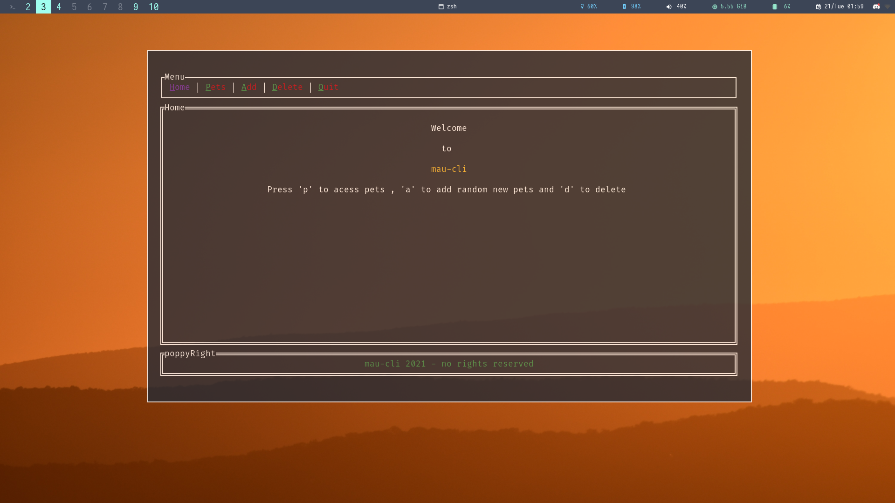
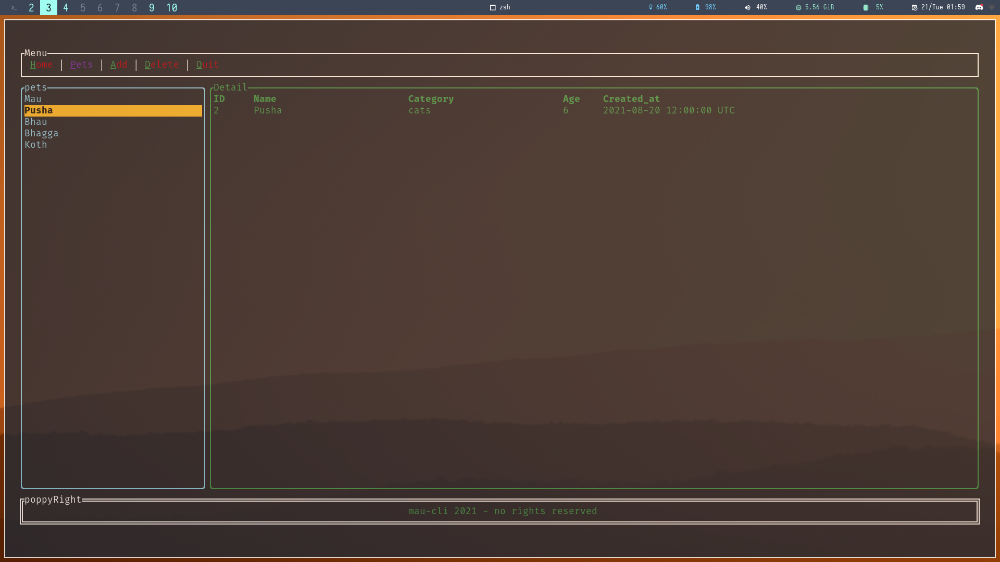

<h1 align="center"> 🐈Mau-CLI 🐕</h1>


## To use :
### 1. Clone the repo and build in release mode 🛠️

```bash 
cd rust-tui-shizz && cargo build --release
```
### 2. Add to path 🛣️
```bash
cp target/release/rust-tui-shizz  ~/.local/bin/rust-tui-shizz
```
### 3. Run the executable , make sure to have cargo v1.54+ 🦀
```bash
./rust-tui-shizz
```
#### Be sure to add DB TO PATH 

====================================================================================

====================================================================================


<h3 align="center">🔞 PETA  🔞<h3>
<p align="center">

</p>

